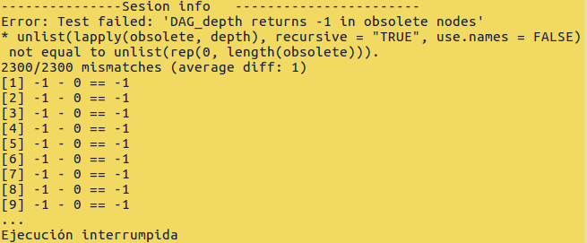
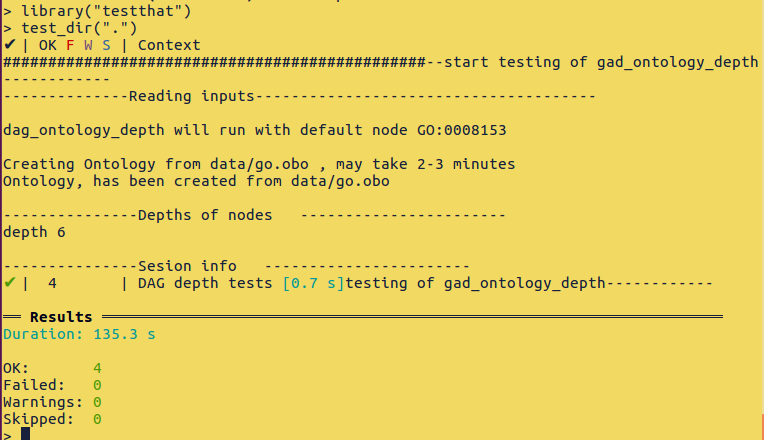
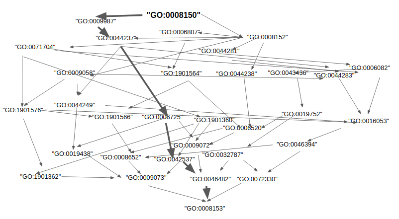
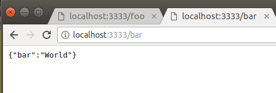
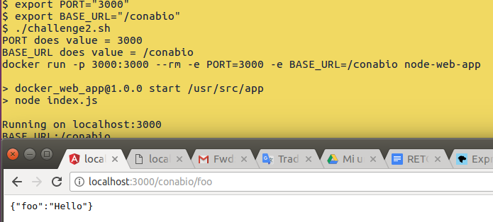

# General observations  
Solutions to Conabio Challenges by Nelly Selem  
Oct 2018  
  
Solutions to this challenges are delivered as executable *nix scripts. Details upon command lines to run them are provided below in the corresponding sections. Answers are attached as a zip file with password conabio. Internet conection will be needed to download docker container and R libraries.  
  
Challenge 1 was solved in R using data from Gene Ontology.   
Challenge 2 was solved in JS using Express framework with a docker container.   
  
\newpage  
## Challenge 1
### Problem 

A directed acyclic graph (DAG) is a directed graph with no cycles, nodes can have multiple parents and
there is a single unique root node. The depth of a node is the minimum number of edges connecting the node with the DAG's root node r.  
  
1. Provide a test that executes your solution and verifies, it works as expected.  
Then write the function that returns the depth of a node given the DAG and test it with your test.  

### Solution  
The solution includes two R scripts: test_dag_ontology_depth.R that contains and runs the tests and dag_ontology_depth.R where the depth function is implemented.      

#### Dependencies:   
_ontologyIndex_  
_testThat_  

#### Data:  
The Gene Ontology DAG.   

#### Scripts  
`dag_ontology_depth.R `  
`test_dag_ontology_depth.R`  

#### Usage:      
_command line 1 (to invoke depth )_  
`./dag_ontology_depth.R <GO:id1> ... <GO:idn> `    
Example  
`cd Test`    
`./dag_ontology_depth.R GO:2001316 GO:2001314`  


_command line 2 ( to invoke tests )_  
`./test_dag_ontology_depth.R `  Runs the test  

or to a more descriptive output and the possibility to run several tests use:  
`$ cd test`  
`$ R`  
`> library (testThat)`  
`> test_dir(".")`  


### Brief report of challenge 1 Test Driven development   
The script `dag_ontology_depth.R` implements `depth(node)`  a function to calculate the depth of nodes from the GAD formed by the Gene Ontology.   
  
`dag_ontology_depth.R`  
*inputs* a list of GO ids   
*output* a table of GO ids with its corresponding depths  
Output is displayed in terminal among few information about the script status.    
  
Several tests were implemented for testing `depth` function, to that end the library testThat was used. The general methodology of Test Driven development (TDD) is as follows. First  a test is implemented such that the test fails. Then, there is a refactoring process where the code of tested function is developed until the test is passed. Finally, a new test is written and the code is refactored again.  
  
In this case the tests were designed to test the `depth` function implemented in the script `dag_ontology_depth.R` with the GO data. The script test_dag_ontology_depth has a source command of the script dag_ontology_depth, after sourcing, all tests are run. An example of failed test before refactoring is shown in Figure 1.   
     
    

  
#### Tests description  
To run the tests script, testing script must be executed: `./test_dag_ontology_depth.R ` When all test are passed there is no ERROR in the output.   Another way to run the tests is using the command test_dir(), this command will provide information about every test instead of only show the first test that fails, Figure 2. To run the test_dir command, go to the directory with your tests and every file that starts with word test will be executed. (See command line 2, invoke tests)
  
    

\newpage  

Finally in this section I described the study cases selected for the tests  

Test1: Roots must be of depth zero, there is no node connecting to a root.  
Test2: Obsolete GOs has no parents, then it has not connection with any root, so they have no depth, to distinguish them from roots, they were assigned a depth of -1.  
Test3: First children of roots must have depth 1. I took the first five of them and not all to save time. But It can be changed the test to assure that every GO with depth 1 is calculated as depth 1.  

Test4: A random case was manually inspected, i.e. all pathways were printed and the minimum was observed. The GO:0008153 has depth 6. Then calculated depth must be 6, Figure 3.  

To do:More test should be implemented, such as test node with depth three in a linear graph and nodes with depth three in a none linear graph, etc.    
\newpage  
  
#### depth function  

The depth function goes back step by step looking for the set of parents of a set of nodes.  
Once the $parents \cap roots$ is not empty the backward search stops and return the depth.    First I thought about using recursion, but since r does work with lists and the ontologyIndex has the parents list I solved this challenge with a while.   


```{r}
## Declare depth function 
depth <- function(node){
	# start depth is 0 for roots or obsolete terms
  	depth_val=0         

 	# if obsolete then depth is -1 because node is not conected at all with roots
 	if (ontology$obsolete[node]=="TRUE") {
		depth_val=-1
	}else{# if not obsolete then the will will search backwards in the parents set until finding a root    
		# node_back will store step by step a list of nodes and their parents
  		node_back<-node	
 
    		while(length(intersect(node_back,roots))==0){ 
		# while set {{node}union{parents node}} intersection with set {root1,root2,root3} is empty
      			depth_val=depth_val+1                  #add one to depth_val 
      			node_back=unique(unlist(ontology$parents[node_back]))  
    			}
		}
  	return (depth_val)
  }
## For the future, would be better to also pass as variables ontology and roots but I didn't have time to search about how to use lapply when using several variables and I need it for the tests
```

Note, this data contains three roots, the problem stablished to work with one root, but that is a particular case of this three roots and the function depth is still applying understood as the minimal set of nodes to the set of roots 

  
  
\newpage  
  
## Challenge 2   
  
### Problem  
Write a simple Server in NodeJS using the Express Framework. The server should respond to two routes "/foo" and "/bar" in JSON format and configured with variables PORT and BASE_URL. Especific requirements of the problem will be addressed in the solution.       

## Solution  
The problem was solved and a docker container is provided. Solution include four files, Dockerfile, index.js, routes.js and challenge2.sh  
  
   
  
### Scripts  
- index.js  Javascript,  create and start the Express server  
- routes.js  use Express Router in which the routes 'foo' and 'bar' are defined.   
- Dockerfile From node, copy JSON packages and starts the with npm using CMD  
- challenge.sh  Bash file, starts docker container, controls PORT and BASE_URL environment variables and send them to docker container  

### Invoke command line  
`cd Node_Express`  
`./challenge2.sh`  

For example the shell commands   
`export PORT="3000"`  
`export BASE_URL="/conabio"`  
`./challenge2.sh`    

start a server that respondes to   
localhost:3000/conabio/foo with "Hello" in JSON, and to   
localhost:3000/conabio/bar with "World" in JSON.    
  
   


  
#### challenge2.sh description    
challenge2 is a bash script that reads environment variables PORT and BASE_URL Consider that the default values are PORT=3333 and BASE_URL="" (empty string).
Finally, challenge 2 calls the docker container node-web-app setting PORT and BASE_URL as environmental variables. The first time that this script is executed it will take some time while downloads the docker image.     

```{bash echo=T, results='hide'}  
if [[ -z $PORT ]]; then   
	echo "PORT does not exist, it will be set PORT=3333"    
	export PORT="3333"  
else   
	echo "PORT does have value = $PORT"  
fi  

if [[ -z $BASE_URL ]]; then  
	echo "BASE_URL does not exist"  
	export BASE_URL=""  
else   
	echo "BASE_URL does have value = $BASE_URL"  
fi  

echo docker run -p $PORT:$PORT --rm -e PORT=${PORT} -e BASE_URL=${BASE_URL} nselem/node-web-app  

```
`docker run -p $PORT:$PORT --rm -e PORT=${PORT} -e BASE_URL=${BASE_URL} nselem/node-web-app`  


### index.js  
In index.js the server is defined and the environment variables are used  
> 'use strict';  
> const express = require('express');  

> // App  
> const app = express();  
> var routes = require("./routes.js");  

> // Variables  
> var BASE_URL=(process.env.BASE_URL||"");  
> var PORT = (process.env.PORT || 3333);  

> console.log(`Running on localhost:${PORT}`);    
> console.log(`BASE URL:${BASE_URL}`);   

> // Passing variables to app  
> app.use(BASE_URL+"/", routes);  
> app.listen(PORT);  
  
  
### routes.js description  
In the routes.js file are specified the following:  
1 "foo" writes "Hello"   
2 "bar"  writes "World" to the response in JSON format.  

>// Constants  
>var express = require("express");  
  
>var appRouter = express.Router();  
>	appRouter.get("/foo", function(req, res){  
>  	var oMyOBject = {foo:'Hello'};  
>   	res.json(oMyOBject);  
>	});  

>	appRouter.get('/bar', function(req, res) {  
>  	var oMyOBject = {bar:'World'};  
>   	res.json(oMyOBject);  
>	});  
  
> module.exports = appRouter;  

## Web References as in Oct 30 - 2018      
OntologyIndex  
https://rdrr.io/cran/ontologyIndex/man/ontologyIndex-package.html  

testThat    
https://journal.r-project.org/archive/2011/RJ-2011-002/RJ-2011-002.pdf   
https://www.johndcook.com/blog/2013/06/12/example-of-unit-testing-r-code-with-testthat/   

JS tutorials     
NodeJS 
https://github.com/nodejs/help/wiki/Installation   

Aprendiendo basicos NodeJS  
https://www.w3schools.com/nodejs/nodejs_get_started.asp  

Tutorial1 app de NodeJs en docker OK  
https://nodejs.org/en/docs/guides/nodejs-docker-webapp/  
  
Tutorial Express  
https://developer.mozilla.org/en-US/docs/Learn/Server-side/Express_Nodejs/routes  
Docker  
https://docs.docker.com/


